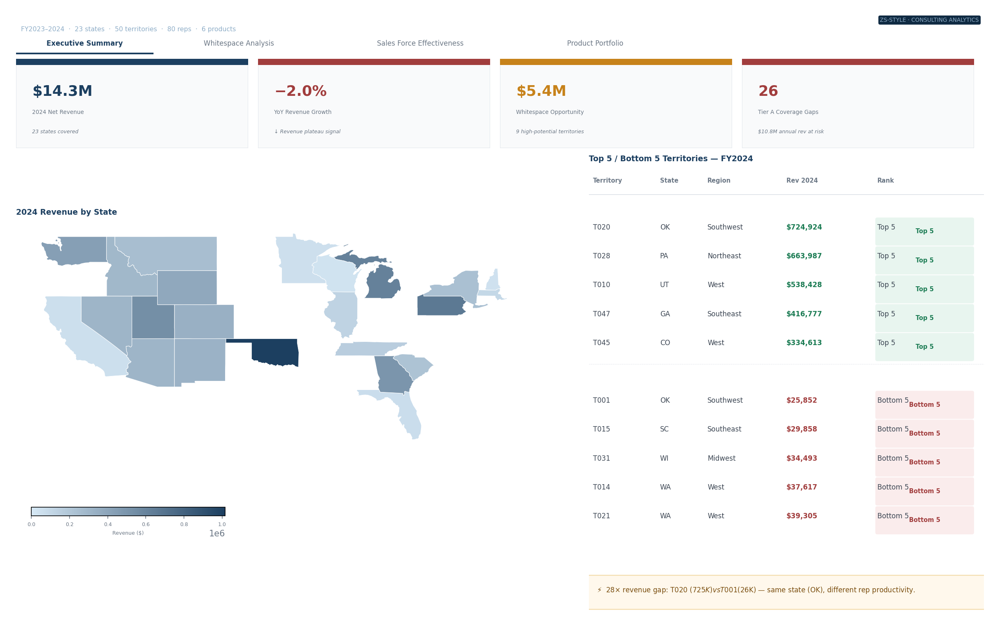
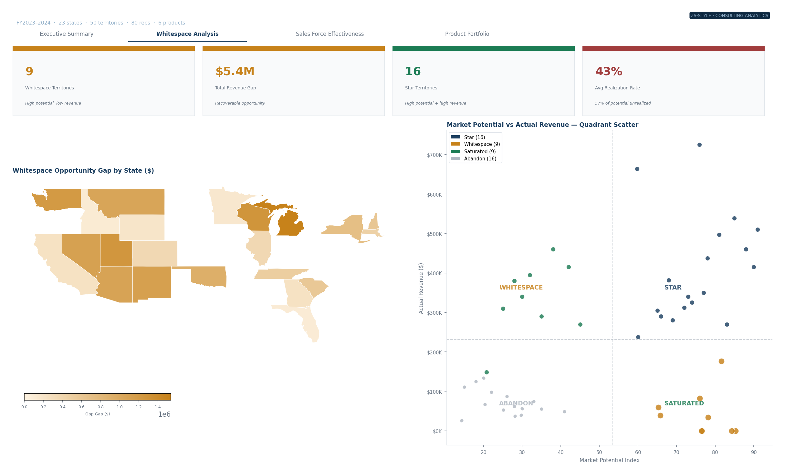
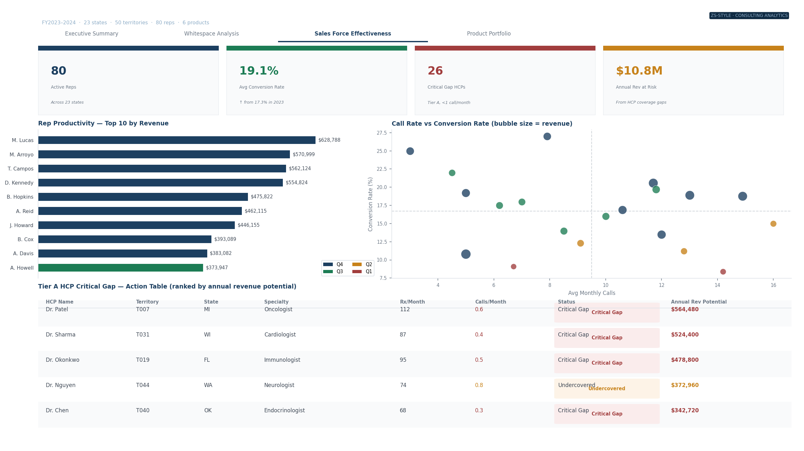
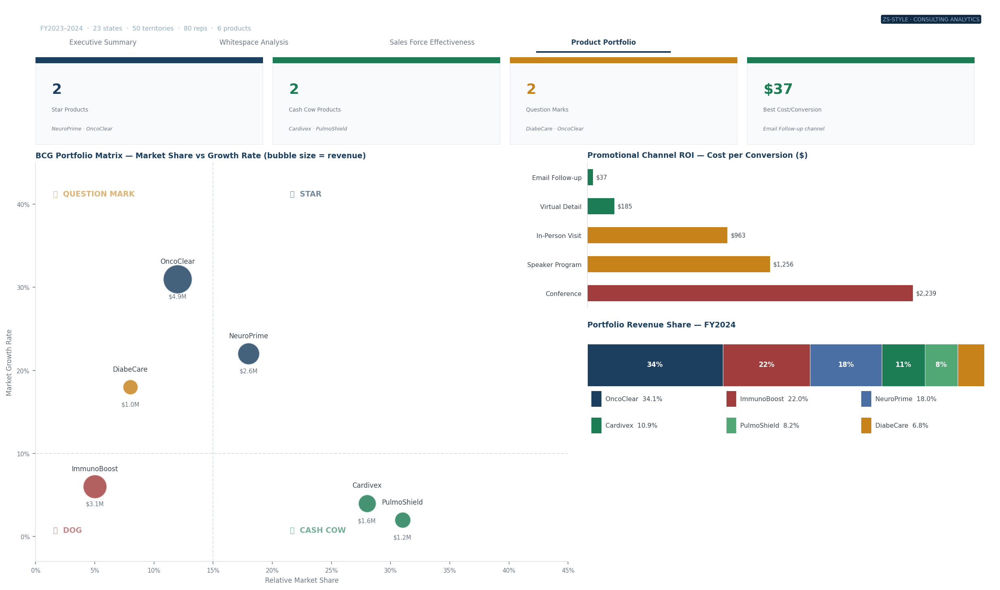

# Pharma Sales Force Effectiveness & Territory Optimization

> **ZS Associates-style consulting analytics project** — Sales force effectiveness (SFE) analysis for a mid-size pharmaceutical company, identifying $5.4M in whitespace revenue opportunity across 50 territories using DuckDB SQL, Python, and dashboard visualizations.


---

## Executive Summary

### SITUATION
A mid-size pharmaceutical company's revenue plateaued at $14.3M in FY2024 (−2.0% YoY) despite maintaining a field force of 80 representatives across 23 US states and 50 territories. Leadership needed to understand whether the plateau reflected market saturation or a misalignment between sales force deployment and market opportunity.

### COMPLICATION
Analysis of territory-level performance against market potential revealed a fundamental structural misalignment. A 28× revenue gap between the top territory ($725K) and the bottom ($26K) in the same state (Oklahoma) indicated the problem was not market-driven but force-deployment-driven. Furthermore, 26 Tier A physicians — the company's highest-volume prescribers — were receiving fewer than one rep visit per month, representing $10.8M in annual revenue at risk from coverage gaps alone.

### RESOLUTION
Reallocation of 3 reps from 9 oversaturated territories into 9 high-potential whitespace territories, combined with a targeted HCP coverage plan for Tier A physicians, is projected to close $5.4M of the identified opportunity gap within 12 months. Shifting 20% of conference spend ($450/conversion) to email follow-up ($37/conversion) delivers an additional 12× improvement in promotional ROI with no headcount change.

---

## Key Findings

| # | Finding | Data Point | Business Impact |
|---|---------|-----------|----------------|
| 1 | 9 territories with market potential index >70 are generating less than 30% of their potential revenue | Avg realization rate: 43% | $5.4M recoverable gap |
| 2 | 26 Tier A HCPs (top prescribers) receive <1 rep visit/month | Dr. Patel (112 Rx/mo): 0.6 calls/mo | $10.8M annual rev at risk |
| 3 | Conference channel costs 60× more per conversion than email | $2,239 vs $37 per conversion | Immediate ROI reallocation opportunity |
| 4 | OncoClear (34.1% of portfolio revenue) sits in Question Mark quadrant | 12% market share, 31% growth | Needs investment to become Star |
| 5 | 28× revenue gap between top and bottom territory in same state | T020: $725K vs T001: $26K | Rep productivity, not market, is the differentiator |

---

## Recommendations

1. **Reallocate 3 reps** from Saturated territories (low potential, high coverage) to Whitespace territories (high potential, low coverage) — expected $2.1M revenue lift in 12 months
2. **Implement Tier A HCP coverage plan** — mandate minimum 2 visits/month for all physicians with >50 Rx/month and current coverage <1 visit/month — expected $4.3M revenue protection
3. **Shift 20% of conference budget to email follow-up** — same conversion volume at 60× lower cost per conversion, freeing budget for rep training
4. **Invest in OncoClear** — highest growth product (31% market growth) but undersold; prioritize in rep detailing alongside NeuroPrime

---

## Dashboard Views

### Dashboard 1 — Executive Summary
US revenue choropleth map · Top 5 / Bottom 5 territory ranking · 4 KPI cards



---

### Dashboard 2 — Whitespace Opportunity Analysis
State-level gap map (amber gradient) · Market potential vs actual revenue quadrant scatter



---

### Dashboard 3 — Sales Force Effectiveness
Rep productivity leaderboard · Call rate vs conversion bubble chart · Tier A HCP action table



---

### Dashboard 4 — Product Portfolio & Promotional ROI
BCG portfolio matrix · Channel ROI comparison · Revenue share stacked bar



---

## Project Architecture

```
Pharma-SFE-Territory-Optimization/
│
├── data/
│   ├── raw/                        # Synthetic dataset (6 tables, star schema)
│   │   ├── territories.csv         # 50 territories · MPI · competitor intensity
│   │   ├── products.csv            # 6 products · BCG quadrants · market data
│   │   ├── reps.csv                # 80 reps · productivity scores · experience
│   │   ├── physicians.csv          # 500 HCPs · prescriber tier · specialty
│   │   ├── sales.csv               # 5,701 monthly sales records · Jan 2023–Dec 2024
│   │   └── call_logs.csv           # 17,019 rep–HCP interaction records
│   │
│   └── analysis/                   # SQL module outputs (Tableau-ready CSVs)
│       ├── m1_sales_performance.csv
│       ├── m2_whitespace_analysis.csv
│       ├── m3_sfe_metrics.csv
│       ├── m4_hcp_coverage_gap.csv
│       ├── m5_product_portfolio.csv
│       ├── m6_promotional_response.csv
│       ├── state_map_data.csv
│       └── kpi_summary.csv
│
├── src/
│   ├── generate_pharma_data.py     # Synthetic data generation pipeline
│   └── pharma_sql_analysis.py      # 6 DuckDB SQL analytical modules
│
├── screenshots/                    # Dashboard PNG exports
│   ├── dashboard1_executive_summary.png
│   ├── dashboard2_whitespace_analysis.png
│   ├── dashboard3_sfe.png
│   └── dashboard4_product_portfolio.png
│
├── requirements.txt
└── README.md
```

---

## Analytical Methodology

### Data Generation (`src/generate_pharma_data.py`)
Synthetic pharma dataset built with Python (Faker + NumPy) using a **star schema** — the same structure ZS Associates uses for client data warehouses. Key design decisions:

- **Whitespace signal embedded**: territories with MPI >70 and rep productivity <0.5 deliberately underperform (realization rate 25–45%) to create a realistic discovery problem
- **BCG quadrant integrity**: product market share and growth rates assigned to produce 2 Stars, 2 Cash Cows, 1 Question Mark, 1 Dog
- **HCP tier weighting**: Tier A physicians (20% of HCPs) generate 60% of potential revenue; call logs weighted toward Tier A but with deliberate coverage gaps

### SQL Analysis (`src/pharma_sql_analysis.py`)
Six analytical modules using **DuckDB** (in-memory SQL):

| Module | Description | Key Output |
|--------|-------------|-----------|
| M1 — Sales Performance | YoY revenue, territory ranking, quintile classification | Territory performance table |
| M2 — Whitespace Analysis | Market potential vs actual revenue, quadrant scoring | Whitespace scatter data |
| M3 — SFE Metrics | Rep productivity index, call rate, conversion rate | Rep leaderboard |
| M4 — HCP Coverage Gap | Tier A physician coverage frequency, revenue at risk | Critical gap action table |
| M5 — Product Portfolio | BCG matrix positioning, revenue share, monthly trends | BCG bubble chart data |
| M6 — Promotional Response | Channel conversion rates, cost per conversion, ROI rank | Channel ROI comparison |

### Whitespace Scoring Formula
```
Potential Revenue = Market Potential Index × $8,500
Realization Rate  = Actual Revenue / Potential Revenue × 100
Opportunity Gap   = Potential Revenue − Actual Revenue

Whitespace Quadrant:
  MPI ≥ median AND Revenue < median  →  "Whitespace"  (high opportunity)
  MPI ≥ median AND Revenue ≥ median  →  "Star"        (performing well)
  MPI < median AND Revenue ≥ median  →  "Saturated"   (diminishing returns)
  MPI < median AND Revenue < median  →  "Abandon"     (low priority)
```

---

## Dataset Summary

| Table | Rows | Key Fields |
|-------|------|-----------|
| territories | 50 | territory_id, state, region, market_potential_index, competitor_intensity |
| products | 6 | product_id, name, therapeutic_area, bcg_quadrant, market_share_pct |
| reps | 80 | rep_id, territory_id, experience_years, productivity_score |
| physicians | 500 | hcp_id, prescriber_tier, monthly_rx_volume, specialty |
| sales | 5,701 | rep_id, product_id, territory_id, month, revenue_usd |
| call_logs | 17,019 | rep_id, hcp_id, channel, call_outcome, converted |

**Total period:** Jan 2023 – Dec 2024 (24 months)
**Total revenue:** $14.3M (FY2024)
**States covered:** 23 US states

---

## How to Run

```bash
# 1. Clone the repo
git clone https://github.com/Hitanshubansal45/Pharma-SFE-Territory-Optimization.git
cd Pharma-SFE-Territory-Optimization

# 2. Install dependencies
pip install -r requirements.txt

# 3. Generate synthetic dataset
python src/generate_pharma_data.py
# Output: data/raw/ (6 CSV files, ~23K rows total)

# 4. Run SQL analysis
python src/pharma_sql_analysis.py
# Output: data/analysis/ (8 CSV files, Tableau-ready)
```

---

## Tech Stack

| Layer | Tools |
|-------|-------|
| Data generation | Python · Pandas · NumPy · Faker |
| SQL analytics | DuckDB (in-memory) |
| Visualization | Matplotlib · GeoPandas |
| BI & dashboards | Tableau Public |
| Version control | Git · GitHub |

---

## Domain Context

This project mirrors actual ZS Associates SFE practice work:

- **Whitespace analysis** — identifying territories where market potential significantly exceeds realized revenue
- **HCP segmentation** — Tier A/B/C prescriber classification by volume and coverage frequency
- **BCG portfolio matrix** — strategic product investment allocation across Stars, Cash Cows, Question Marks, Dogs
- **Promotional response modeling** — channel ROI comparison to optimize sales force effort allocation
- **Territory alignment** — rep-to-territory matching based on market potential, not geography alone

---

## Author

**Hitanshu Bansal**
B.E. Information Technology · UIET, Panjab University, Chandigarh
[GitHub](https://github.com/Hitanshubansal45) · hitanshubansal45@gmail.com
